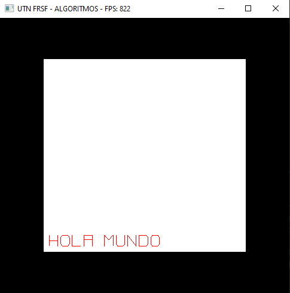

# Canvas
Proyecto de estudiantes de la cátedra Algoritmos y Estructura de Datos de la Universidad Tecnológica Nacional, Facultad Regional Santa Fe, para brindar un entorno gráfico sencillo para el desarrollo de proyectos académicos.
<br>
Basado en el funcionamiento de Processing, permite dibujar en la pantalla utilizando como motor gráfico de fondo OpenGL.
<br>
La librería no tiene dependencias fuera de OpenGL (Ya viene en los compiladores estándares).
<br><br>
## Para empezar
Primero que nada, tenemos que incluir la librería.
```
#include "Canvas.h" //Replace with yout path lo library
```
Después ya estamos en condiciones de definir las dos funciones que nos permitirán dibujar. La ejecución de estas funciones es manejada por la librería, solo debemos definirlas para indicarle a Canvas.h qué queremos que hagan.
<br>
Por su parte setUp se ejcuta una única vez al inicializar la ventana. Podiendo usar un tipo de dato abstracto llamado Canvas en donde se guardan varias de las variables que necesita la librería para trabajar. Por ahora, las variables mas importantes son width y height, en donde podemos especificar el ancho y el alto de la ventana (en pixeles).
```
int setUp()
{
    canvas.width = 500;
    canvas.height = 500;
    return 0;
}
```
Ya con la función setUp definida, pasamos a definir el metodo en el que le diremos a la librería que deseamos dibujar.
```
int loop()
{
    fillRect(0.15*500,0.15*500,0.7*500,0.7*500,0xffffff); //Imprimimos un cuadrado blanco con sus coordenadas x e y, y su  ancho y alto.
    write("HOLA MUNDO",0.15*500+10,0.15*500+10,10,0,0xff0000); //Imprimimos dentro del cuadrado 'HOLA MUNDO' en Rojo.
    return 0;
}
```
<br>
<br>
Listo! :wink: ya podes compilar y ejecutar tu programa. Deberías ver algo como esto...
<br>
<br>

